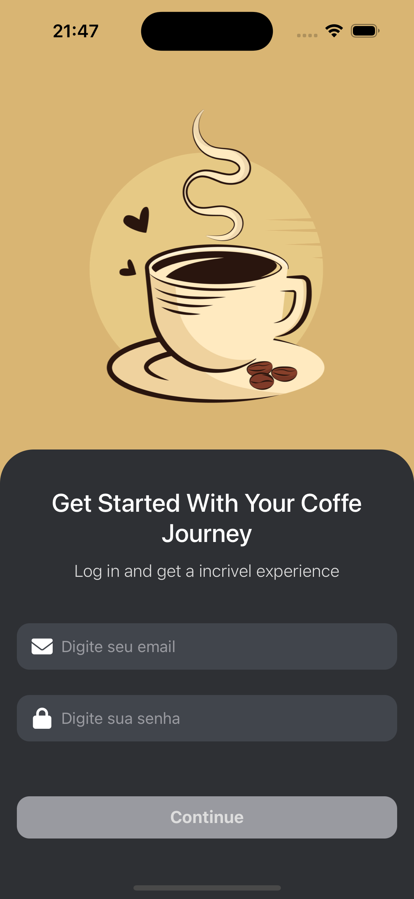
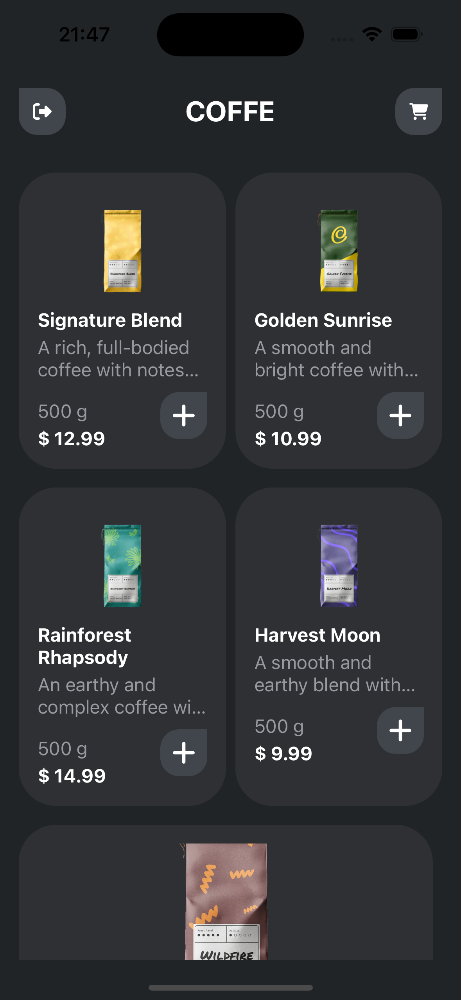

🎉 **Bem-vindo ao Coffe App** 🚀

<div align="center">
  
  
</div>


Este projeto é um aplicativo mobile desenvolvido em React Native com TypeScript, focado na listagem de cafés. Ele oferece uma interface intuitiva para explorar e visualizar informações detalhadas sobre diferentes cafés, utilizando Zustand para gerenciamento eficiente de estado.

## ℹ️ Sobre o Projeto

O CoffeApp é uma aplicação web simples que permite aos usuários criar e visualizar tarefas. Foi desenvolvido com as seguintes tecnologias:

- Linguagem: Typescript
- Lib: React Native
- Estilo: StyleSheet


## 🛠️ Ferramentas Utilizadas

- React Native
- AsyncStorage
- Zustand
- React navigation
- Jest

## 📚 Referências utilizadas
- API: https://fake-coffee-api.vercel.app
- LAYOUT DESIGN: https://dribbble.com/shots/23534133-Smart-coffee-machine-app


## 🚀 Executando o Projeto

Siga as instruções abaixo para executar o projeto em seu ambiente local:

1. **Clone o repositório:**

   ```
   git clone https://github.com/seu-usuario/nome-do-repositorio.git
   ```

2. **Navegue até o diretório do projeto:**

   ```
   cd Coffe2
   ```

3. **Instale as dependências:**

   ```
   yarn
   ```

4. **(IOS) Instale os pods:**

   ```
   cd ios && pod install && cd ..
   ```
   
5. **Inicie o metro da aplicação:**

   ```
   yarn start 
   ```

6. **Para Android - Instale o app no emulador ou dispositivo físico:**

   ```
   yarn android 
   ```

6. **Para IOS - Instale o app no emulador ou dispositivo físico:**

   ```
   yarn ios 
   ```
   
5. **Acesse a aplicação:**

   Após esses passos, o app irá iniciar automaticamento no seu emulador ou dispositivo físico

## 📂 Estrutura de pastas
**1. components/**

Contém componentes reutilizáveis e independentes, usados em diversas partes do aplicativo, como botões, cabeçalhos, listas, entre outros.

**2. screens/**

Abriga as telas principais do aplicativo, cada uma representando uma funcionalidade distinta:

CoffeeList: Tela que exibe a lista de cafés, permitindo ao usuário explorar as opções disponíveis.
SignIn: Tela de autenticação, onde os usuários podem realizar login para acessar o aplicativo.

**3. stores/**

Contém os estados globais gerenciados com Zustand, separados por domínio para maior organização:

useCoffeeStore.ts: Gerencia o estado relacionado à listagem de cafés, como dados e filtros.
useAuth.ts: Gerencia o estado de autenticação, incluindo informações do usuário e status de login.

**4. global/**

Centraliza configurações globais do aplicativo:

theme.ts: Define o tema do app, incluindo cores, fontes e outros estilos compartilhados, garantindo consistência visual.

**5. routes/**

Gerencia a navegação do aplicativo. Define as rotas entre as telas e configura o fluxo de navegação (autenticado e não autenticado).

## 🗂️ Arquitetura

O projeto segue uma abordagem baseada em stores independentes para gerenciar estados globais de maneira eficiente, utilizando a biblioteca Zustand. Isso oferece maior modularidade, separação de responsabilidades e uma interface simples para manipulação de estados.

**🔒useAuthStore (Autenticação)**

Esta store é responsável por gerenciar o estado de autenticação do usuário:

1. Gerenciamento de credenciais: Controle do email e senha inseridos pelo usuário.

2. Validação: Regras claras para validação de email e senha.

3. Email deve seguir o formato correto (ex.: "usuario@dominio.com").

4. Senha deve conter pelo menos 8 caracteres, incluindo maiúsculas, minúsculas, números e caracteres especiais.

5. Persistência: Salvamento seguro das credenciais usando AsyncStorage.

**Funções principais:**
1. login: Valida as credenciais, autentica o usuário e salva os dados localmente.

2. logout: Remove os dados de autenticação do armazenamento e redefine o estado.

3. loadAuthState: Recupera as credenciais do armazenamento para manter o estado entre sessões.

4. Mensagens de erro: Exibição de erros de validação específicos para email e senha.


---


**☕useCoffeStore (Listagem e Carrinho de Produtos)**

Esta store gerencia a listagem de cafés e o estado do carrinho de compras:

1. Listagem de produtos: Busca os produtos da API (fetchProducts), com limite ajustável de itens carregados.

2. Evita duplicação de produtos utilizando um conjunto (Set) para armazenar IDs carregados.

3. Carregamento incremental com a função searchMore, permitindo busca contínua (infinite scroll).

4. Controle de itens adicionados ao carrinho (addItemOnCart).

5. Incrementa a quantidade de itens no carrinho com cada adição.


## 📝 Contribuição

Se você deseja contribuir com melhorias para o projeto, siga as etapas abaixo:

1. Faça um fork do repositório e clone-o em sua máquina.
2. Crie uma nova branch para suas modificações.
3. Faça as alterações necessárias e adicione-as ao stage.
4. Envie um pull request para que suas modificações sejam revisadas.


